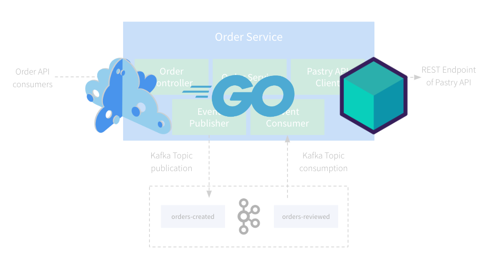

# Microcks Testcontainers Go Demo



This application is a demonstration on how to integrate Microcks via Testcontainers within your development inner-loop.

You will work with a Go application and explore how to:
* Use Microcks for **provisioning third-party API mocks**,
* Use Microcks for **simulating external Kafka events publishers**,
* Write tests using Microcks **contract-testing** features for both **REST/OpenAPI based APIs and Events/AsyncAPI** based messaging

## Table of contents

* [Step 1: Getting Started](step-1-getting-started.md)
* [Step 2: Exploring the app](step-2-exploring-the-app.md)
* [Step 3: Local Development Experience with Microcks](step-3-local-development-experience.md)
* [Step 4: Write Tests for REST](step-4-write-rest-tests.md)
* [Step 5: Write Tests for Async](step-5-write-async-tests.md)

## License Summary

The code in this repository is made available under the MIT license. See the [LICENSE](LICENSE) file for details.


## Running tests

```sh
$ go test -timeout 30s -run "^TestGetPastry$" ./internal/client -v

=== RUN   TestGetPastry
2024/09/25 22:05:32 github.com/testcontainers/testcontainers-go - Connected to docker: 
  Server Version: 24.0.2
  API Version: 1.43
  Operating System: Docker Desktop
  Total Memory: 11962 MB
  Testcontainers for Go Version: v0.34.0
  Resolved Docker Host: unix:///var/run/docker.sock
  Resolved Docker Socket Path: /var/run/docker.sock
  Test SessionID: 1b0461d7b7d13ee30ffb86fc72d836fcc9d8ae715fb0407d2af3f4e088d26657
  Test ProcessID: 7629b56f-618d-4c6d-a37d-37ea9b7d6e56
2024/09/25 22:05:32 🐳 Creating container for image testcontainers/ryuk:0.9.0
2024/09/25 22:05:32 ✅ Container created: c23103c472eb
2024/09/25 22:05:32 🐳 Starting container: c23103c472eb
2024/09/25 22:05:32 ✅ Container started: c23103c472eb
2024/09/25 22:05:32 ⏳ Waiting for container id c23103c472eb image: testcontainers/ryuk:0.9.0. Waiting for: &{Port:8080/tcp timeout:<nil> PollInterval:100ms skipInternalCheck:false}
2024/09/25 22:05:32 🔔 Container is ready: c23103c472eb
2024/09/25 22:05:32 🐳 Creating container for image quay.io/microcks/microcks-uber:1.9.0-native
2024/09/25 22:05:32 ✅ Container created: 77ddd018ca5f
2024/09/25 22:05:32 🐳 Starting container: 77ddd018ca5f
2024/09/25 22:05:32 ✅ Container started: 77ddd018ca5f
2024/09/25 22:05:32 ⏳ Waiting for container id 77ddd018ca5f image: quay.io/microcks/microcks-uber:1.9.0-native. Waiting for: &{timeout:<nil> Log:Started MicrocksApplication IsRegexp:false Occurrence:1 PollInterval:100ms}
2024/09/25 22:05:33 🔔 Container is ready: 77ddd018ca5f
2024/09/25 22:05:33 🐳 Terminating container: 77ddd018ca5f
2024/09/25 22:05:33 🚫 Container terminated: 77ddd018ca5f
--- PASS: TestGetPastry (1.61s)
PASS
ok      github.com/microcks/microcks-testcontainers-go-demo/internal/client     1.940s
```

```sh
$ go test -timeout 30s -run "^TestListPastries$" ./internal/client -v

=== RUN   TestListPastries
2024/09/25 22:05:00 github.com/testcontainers/testcontainers-go - Connected to docker: 
  Server Version: 24.0.2
  API Version: 1.43
  Operating System: Docker Desktop
  Total Memory: 11962 MB
  Testcontainers for Go Version: v0.34.0
  Resolved Docker Host: unix:///var/run/docker.sock
  Resolved Docker Socket Path: /var/run/docker.sock
  Test SessionID: 96332d7af971d08d478592eca13f0c15f30f89ee17251b870f732595e9f5f341
  Test ProcessID: bfbf6820-0924-4e6a-b6f9-9eeb5f677ac5
2024/09/25 22:05:00 🐳 Creating container for image testcontainers/ryuk:0.9.0
2024/09/25 22:05:00 ✅ Container created: eb0f86cd914d
2024/09/25 22:05:00 🐳 Starting container: eb0f86cd914d
2024/09/25 22:05:00 ✅ Container started: eb0f86cd914d
2024/09/25 22:05:00 ⏳ Waiting for container id eb0f86cd914d image: testcontainers/ryuk:0.9.0. Waiting for: &{Port:8080/tcp timeout:<nil> PollInterval:100ms skipInternalCheck:false}
2024/09/25 22:05:00 🔔 Container is ready: eb0f86cd914d
2024/09/25 22:05:00 🐳 Creating container for image quay.io/microcks/microcks-uber:1.9.0-native
2024/09/25 22:05:00 ✅ Container created: a7f410f91fb2
2024/09/25 22:05:00 🐳 Starting container: a7f410f91fb2
2024/09/25 22:05:01 ✅ Container started: a7f410f91fb2
2024/09/25 22:05:01 ⏳ Waiting for container id a7f410f91fb2 image: quay.io/microcks/microcks-uber:1.9.0-native. Waiting for: &{timeout:<nil> Log:Started MicrocksApplication IsRegexp:false Occurrence:1 PollInterval:100ms}
2024/09/25 22:05:01 🔔 Container is ready: a7f410f91fb2
2024/09/25 22:05:01 🐳 Terminating container: a7f410f91fb2
2024/09/25 22:05:01 🚫 Container terminated: a7f410f91fb2
--- PASS: TestListPastries (1.27s)
PASS
ok      github.com/microcks/microcks-testcontainers-go-demo/internal/client     1.586s
```

```sh
$ go test ./internal/test -test.timeout=20m -failfast -v -test.run TestBaseSuite -testify.m ^TestOpenAPIContractAdvanced

$ go test ./internal/test -test.timeout=20m -failfast -v -test.run TestBaseSuite -testify.m ^TestPostmanCollectionContract

$ go test ./internal/test -test.timeout=20m -failfast -v -test.run TestBaseSuite -testify.m ^TestOrderEventIsPublishedWhenOrderIsCreated

$ go test ./internal/test -test.timeout=20m -failfast -v -test.run TestBaseSuite -testify.m ^TestEventIsConsumedAndProcessedByService
```
