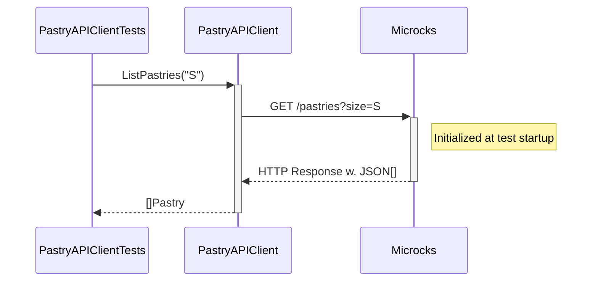

# Step 4: Let's write tests for the REST APIs

So far, we focused on being able to run the application locally without having to install or run any dependent services manually.
But there is nothing more painful than working on a codebase without a comprehensive test suite.

Let's fix that!!

## First Test - Verify our RESTClient

In this section, we'll focus on testing the `Pastry API Client` component of our application:


Let's review the unit test spec `pastry_api_test.go` under `internal/client`.

```go
func setup(ctx context.Context, t *testing.T) *microcks.MicrocksContainer {
	t.Helper()

	microcksContainer, err := microcks.Run(ctx,
		"quay.io/microcks/microcks-uber:1.10.0-native",
		microcks.WithMainArtifact("../../testdata/apipastries-openapi.yaml"),
		microcks.WithSecondaryArtifact("../../testdata/apipastries-postman-collection.json"),
	)
	require.NoError(t, err)
	t.Cleanup(func() {
		if err := microcksContainer.Terminate(ctx); err != nil {
			t.Fatalf("failed to terminate container: %s", err)
		}
	})
	return microcksContainer
}
```

This is where we're launching the Microcks Testcontainers module and configure it with the resources we need. Here we're loading 
the Pastry API [`apipastries-openapi.yml`](testdata/apipastries-openapi.yaml) OpenAPI specification as well as a complementary
[`apipastries-postman-collection.json`](testdata/apipastries-postman-collection.json) Postman Collection that contains additional 
examples.

Then, we can simply proceed and write some tests that will first execute the `setup()` function as a prelude to tests. Then, we
have to configure our API client to use a REST mock endpoint provided by the Microcks container for this API.

Then, we can simply proceed and execute some tests:

```go
func TestGetPastry(t *testing.T) {
	ctx := context.Background()
	microcksContainer := setup(ctx, t)

	baseAPIURL, err := microcksContainer.RestMockEndpoint(ctx, "API Pastries", "0.0.1")
	require.NoError(t, err)
	pastryAPIClient := client.NewPastryAPIClient(baseAPIURL)

	pastry, err := pastryAPIClient.GetPastry("Millefeuille")
	require.NoError(t, err)
	require.Equal(t, "Millefeuille", pastry.Name)
	require.Equal(t, "available", pastry.Status)

	pastry, err = pastryAPIClient.GetPastry("Eclair Cafe")
	require.NoError(t, err)
	require.Equal(t, "Eclair Cafe", pastry.Name)
	require.Equal(t, "available", pastry.Status)

	pastry, err = pastryAPIClient.GetPastry("Eclair Chocolat")
	require.NoError(t, err)
	require.Equal(t, "Eclair Chocolat", pastry.Name)
	require.Equal(t, "unknown", pastry.Status)
}

func TestListPastries(t *testing.T) {
	ctx := context.Background()
	microcksContainer := setup(ctx, t)

	baseAPIURL, err := microcksContainer.RestMockEndpoint(ctx, "API Pastries", "0.0.1")
	require.NoError(t, err)
	pastryAPIClient := client.NewPastryAPIClient(baseAPIURL)

	pastries, err := pastryAPIClient.ListPastries("S")
	require.NoError(t, err)
	assert.Len(t, pastries, 1)

	pastries, err = pastryAPIClient.ListPastries("M")
	require.NoError(t, err)
	assert.Len(t, pastries, 2)

	pastries, err = pastryAPIClient.ListPastries("L")
	require.NoError(t, err)
	assert.Len(t, pastries, 2)
}
```

> You can execute those tests from your IDE or from the terminal using the `go test -timeout 30s -run "^TestGetPastry$" ./internal/client -v` and `go test -timeout 30s -run "^TestListPastries$" ./internal/client -v` commands.

If you run those test, they should pass and that means we have successfully configured the API client to invoke the Microcks container.
Within this test:
* We're reusing the data that comes from the examples in the `Pastry API` OpenAPI specification and Postman collection.
* The `pastryAPIClient` has been configured with a `baseAPIURL` that is wired to the Microcks mock endpoints.
* We're validating the configuration of this client as well as all the JSON and network serialization details of our configuration!  

The sequence diagram below details the test sequence. Microcks is used as a third-party backend to allow going through all the layers:



## Second Test - Verify the technical conformance of Order Service API

The 2nd thing we want to validate is the conformance of the `Order API` we'll expose to consumers. In this section and the next one,
we'll focus on testing the `OrderController` component of our application:


## Third Test - Verify the business conformance of Order Service API

The above section allows us to validate the technical conformance but not the business one! Imagine we forgot to record all the
requested products in the order or change the total price in resulting order. This could raise some issues!

You're now sure that beyond the technical conformance, the `Order Service` also behaves as expected regarding business 
constraints. 

### 
[Next](step-5-write-async-tests.md)