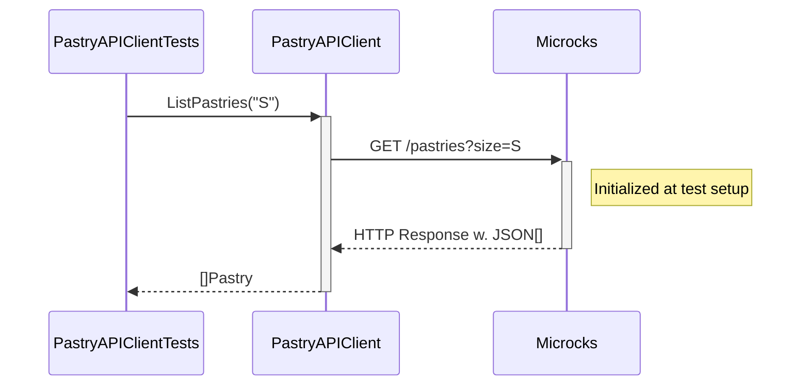
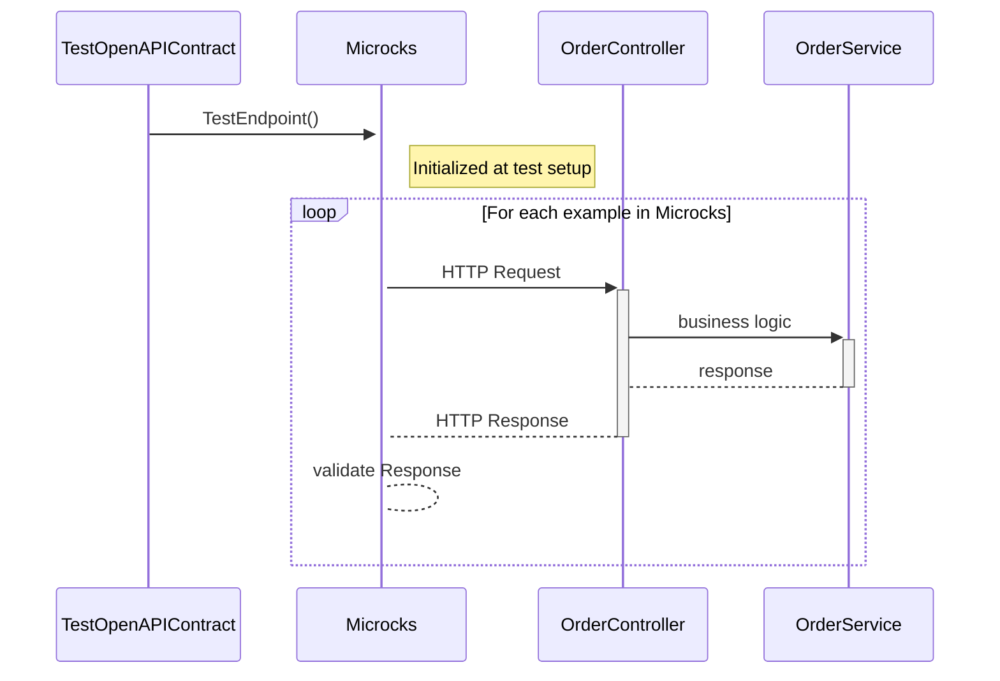

# Step 4: Let's write tests for the REST APIs

So far, we focused on being able to run the application locally without having to install or run any dependent services manually.
But there is nothing more painful than working on a codebase without a comprehensive test suite.

Let's fix that!!

## First Test - Verify our RESTClient

In this section, we'll focus on testing the `Pastry API Client` component of our application:


Let's review the unit test spec `pastry_api_test.go` under `internal/client`.

```go
func setup(ctx context.Context, t *testing.T) *microcks.MicrocksContainer {
	t.Helper()

	microcksContainer, err := microcks.Run(ctx,
		"quay.io/microcks/microcks-uber:1.10.0-native",
		microcks.WithMainArtifact("../../testdata/apipastries-openapi.yaml"),
		microcks.WithSecondaryArtifact("../../testdata/apipastries-postman-collection.json"),
	)
	require.NoError(t, err)
	t.Cleanup(func() {
		if err := microcksContainer.Terminate(ctx); err != nil {
			t.Fatalf("failed to terminate container: %s", err)
		}
	})
	return microcksContainer
}
```

This is where we're launching the Microcks Testcontainers module and configure it with the resources we need. Here we're loading 
the Pastry API [`apipastries-openapi.yml`](testdata/apipastries-openapi.yaml) OpenAPI specification as well as a complementary
[`apipastries-postman-collection.json`](testdata/apipastries-postman-collection.json) Postman Collection that contains additional 
examples.

Then, we can simply proceed and write some tests that will first execute the `setup()` function as a prelude to tests. Then, we
have to configure our API client to use a REST mock endpoint provided by the Microcks container for this API.

Then, we can simply proceed and execute some tests:

```go
func TestGetPastry(t *testing.T) {
	ctx := context.Background()
	microcksContainer := setup(ctx, t)

	baseAPIURL, err := microcksContainer.RestMockEndpoint(ctx, "API Pastries", "0.0.1")
	require.NoError(t, err)
	pastryAPIClient := client.NewPastryAPIClient(baseAPIURL)

	pastry, err := pastryAPIClient.GetPastry("Millefeuille")
	require.NoError(t, err)
	require.Equal(t, "Millefeuille", pastry.Name)
	require.Equal(t, "available", pastry.Status)

	pastry, err = pastryAPIClient.GetPastry("Eclair Cafe")
	require.NoError(t, err)
	require.Equal(t, "Eclair Cafe", pastry.Name)
	require.Equal(t, "available", pastry.Status)

	pastry, err = pastryAPIClient.GetPastry("Eclair Chocolat")
	require.NoError(t, err)
	require.Equal(t, "Eclair Chocolat", pastry.Name)
	require.Equal(t, "unknown", pastry.Status)
}

func TestListPastries(t *testing.T) {
	ctx := context.Background()
	microcksContainer := setup(ctx, t)

	baseAPIURL, err := microcksContainer.RestMockEndpoint(ctx, "API Pastries", "0.0.1")
	require.NoError(t, err)
	pastryAPIClient := client.NewPastryAPIClient(baseAPIURL)

	pastries, err := pastryAPIClient.ListPastries("S")
	require.NoError(t, err)
	assert.Len(t, pastries, 1)

	pastries, err = pastryAPIClient.ListPastries("M")
	require.NoError(t, err)
	assert.Len(t, pastries, 2)

	pastries, err = pastryAPIClient.ListPastries("L")
	require.NoError(t, err)
	assert.Len(t, pastries, 2)
}
```

> You can execute those tests from your IDE or from the terminal using the `go test -timeout 30s -run "^TestGetPastry$" ./internal/client -v` and `go test -timeout 30s -run "^TestListPastries$" ./internal/client -v` commands.

If you run those test, they should pass and that means we have successfully configured the API client to invoke the Microcks container.
Within this test:
* We're reusing the data that comes from the examples in the `Pastry API` OpenAPI specification and Postman collection.
* The `pastryAPIClient` has been configured with a `baseAPIURL` that is wired to the Microcks mock endpoints.
* We're validating the configuration of this client as well as all the JSON and network serialization details of our configuration!  

The sequence diagram below details the test sequence. Microcks is used as a third-party backend to allow going through all the layers:



### 🎁 Bonus step - Check the mock endpoints are actually used

While the above test is a good start, it doesn't actually check that the mock endpoints are being used. In a more complex application, it's 
possible that the client is not correctly configured or use some cache or other mechanism that would bypass the mock endpoints. In order to 
check that you can actually use the `Verify()` function available on the Microcks container:

```go
func TestGetPastry(t *testing.T) {
	ctx := context.Background()
	microcksContainer := setup(ctx, t)

	baseAPIURL, err := microcksContainer.RestMockEndpoint(ctx, "API Pastries", "0.0.1")
	require.NoError(t, err)
	pastryAPIClient := client.NewPastryAPIClient(baseAPIURL)

	pastry, err := pastryAPIClient.GetPastry("Millefeuille")
	require.NoError(t, err)
	require.Equal(t, "Millefeuille", pastry.Name)
	require.Equal(t, "available", pastry.Status)

	pastry, err = pastryAPIClient.GetPastry("Eclair Cafe")
	require.NoError(t, err)
	require.Equal(t, "Eclair Cafe", pastry.Name)
	require.Equal(t, "available", pastry.Status)

	pastry, err = pastryAPIClient.GetPastry("Eclair Chocolat")
	require.NoError(t, err)
	require.Equal(t, "Eclair Chocolat", pastry.Name)
	require.Equal(t, "unknown", pastry.Status)

	// Check that the mock API has really been invoked.
	mockInvoked, err := microcksContainer.Verify(ctx, "API Pastries", "0.0.1")
	require.NoError(t, err)
	require.True(t, mockInvoked)
}
```

`Verify()` takes the target API name and version as arguments and returns a boolean indicating if the mock has been invoked. 
This is a good way to ensure that the mock endpoints are actually being used in your test.

If you need finer-grained control, you can also check the number of invocations with `ServiceInvocationsCount()`. This way 
you can check that the mock has been invoked the correct number of times:

```go
func TestListPastries(t *testing.T) {
	ctx := context.Background()
	microcksContainer := setup(ctx, t)

	baseAPIURL, err := microcksContainer.RestMockEndpoint(ctx, "API Pastries", "0.0.1")
	require.NoError(t, err)
	pastryAPIClient := client.NewPastryAPIClient(baseAPIURL)

	// Get the number of invocations before our test.
	beforeMockInvocations, err := microcksContainer.ServiceInvocationsCount(ctx, "API Pastries", "0.0.1")
	require.NoError(t, err)

	pastries, err := pastryAPIClient.ListPastries("S")
	require.NoError(t, err)
	assert.Len(t, pastries, 1)

	pastries, err = pastryAPIClient.ListPastries("M")
	require.NoError(t, err)
	assert.Len(t, pastries, 2)

	pastries, err = pastryAPIClient.ListPastries("L")
	require.NoError(t, err)
	assert.Len(t, pastries, 2)

	// Check our mock API has been invoked the correct number of times.
	afterMockInvocations, err := microcksContainer.ServiceInvocationsCount(ctx, "API Pastries", "0.0.1")
	require.NoError(t, err)
	assert.Equal(t, 3, afterMockInvocations-beforeMockInvocations)
}
```

This is a super powerful way to ensure that your application logic (caching, no caching, etc.) is correctly implemented and use the mock endpoints when required 🎉

## Integration Test SetUp

From now, all the tests we'll write will be integration tests in the sense that they'll need a fully running application.
Our integration tests setup is defined into the `suite_test.go` file in the `internal/test` folder. The `SetupSuite()``
function defines a common `BaseSuite` struct as follows:

```go
func (s *BaseSuite) SetupSuite() {
	//[...]

	kafkaContainer, err := kafkaTC.Run(ctx,
		"confluentinc/confluent-local:7.5.0",
		network.WithNetwork([]string{"kafka"}, net),

		testcontainers.WithEnv(map[string]string{
			"KAFKA_LISTENERS":                      "PLAINTEXT://0.0.0.0:9093,BROKER://0.0.0.0:9092,CONTROLLER://0.0.0.0:9094,TC://0.0.0.0:19092",
			"KAFKA_LISTENER_SECURITY_PROTOCOL_MAP": "PLAINTEXT:PLAINTEXT,BROKER:PLAINTEXT,CONTROLLER:PLAINTEXT,TC:PLAINTEXT",
			"KAFKA_ADVERTISED_LISTENERS":           "PLAINTEXT://%s:%d,BROKER://%s:9092,TC://kafka:19092",
		}),
	)
	//[...]

	// Configure and startup a new MicrocksContainersEnsemble.
	microcksEnsemble, err := ensemble.RunContainers(ctx,
		ensemble.WithMainArtifact("../../testdata/order-service-openapi.yaml"),
		ensemble.WithMainArtifact("../../testdata/order-events-asyncapi.yaml"),
		ensemble.WithMainArtifact("../../testdata/apipastries-openapi.yaml"),
		ensemble.WithSecondaryArtifact("../../testdata/order-service-postman-collection.json"),
		ensemble.WithSecondaryArtifact("../../testdata/apipastries-postman-collection.json"),
		ensemble.WithPostman(),
		ensemble.WithAsyncFeature(),
		ensemble.WithNetwork(net),
		ensemble.WithHostAccessPorts([]int{server.DefaultApplicationPort}),
		ensemble.WithKafkaConnection(kafkaCon.Connection{
			BootstrapServers: "kafka:19092",
		}),
	)

    //[...]

    // Configure and start the application.
	baseAPIURL, err := microcksEnsemble.GetMicrocksContainer().RestMockEndpoint(ctx, "API Pastries", "0.0.1")
	s.Require().NoError(err)

	reviewedTopic := microcksEnsemble.GetAsyncMinionContainer().KafkaMockTopic("Order Events API", "0.1.0", "PUBLISH orders-reviewed")

    applicationProperties := &app.ApplicationProperties{
		PastriesBaseURL:          baseAPIURL,
		OrderEventsCreatedTopic:  "orders-created",
		OrderEventsReviewedTopic: reviewedTopic,
		KafkaConfigMap: &kafka.ConfigMap{
			"bootstrap.servers": brokerURL[0],
			"group.id":          "order-service",
			"auto.offset.reset": "latest",
		},
	}

	appRun := server.NewApplication(applicationProperties)
    //[...]
}
```

* We configure and start a Kafka container that will be used by our application,
* We also configure a `MicrocksContainersEnsemble` that will be responsible for providing mocks for our 3rd party systems
and execute contract tests. The `microcksEnsemble` is also connected to the Kafka container,
* We finally configure and start the application itself to use the endpoints provided by the Kafka broker and the Microcks
container.

And that's it! 🎉 

## Second Test - Verify the technical conformance of Order Service API

Back to our tests 🧪 The 2nd thing we want to validate is the conformance of the `Order API` we'll expose to consumers.
In this section and the next one, we'll focus on testing the `OrderController` component of our application:


Microcks Testcontainer integration provides another approach by letting you reuse the OpenAPI specification directly in your test suite, without having to write assertions and validation of messages for API interaction.

Let's review the test suite `suite_test.go` under `internal/test` folder. 

```go
func (s *BaseSuite) TestOpenAPIContract() {
	// Test code goes here which can leverage the context
	// Prepare a Microcks Test.
	testRequest := client.TestRequest{
		ServiceId:    "Order Service API:0.1.0",
		RunnerType:   client.TestRunnerTypeOPENAPISCHEMA,
		TestEndpoint: fmt.Sprintf("http://host.testcontainers.internal:%d/api", server.DefaultApplicationPort),
		Timeout:      2000,
	}
	testResult, err := s.microcksEnsemble.GetMicrocksContainer().TestEndpoint(context.Background(), &testRequest)
	s.Require().NoError(err)

	s.T().Logf("Test Result success is %t", testResult.Success)

	// Log TestResult raw structure.
	j, err := json.Marshal(testResult)
	s.Require().NoError(err)
	s.T().Log(string(j))

	s.True(testResult.Success)
	s.Equal(1, len(*testResult.TestCaseResults)) //nolint:testifylint
}
```

> You can execute this test from the terminal using the `go test ./internal/test -test.timeout=20m -failfast -v -test.run TestBaseSuite -testify.m ^TestOpenAPIContract` command.

Here, we're using a Microcks-provided `TestRequest` object that allows us to specify to Microcks the scope of the conformance
test we want to run:
* We ask for testing our endpoint against the service interface of `Order Service API` in version `0.1.0`.
  These are the identifiers found in the `order-service-openapi.yml` file.
* We ask Microcks to validate the `OpenAPI Schema` conformance by specifying a `RunnerType`.
* We ask Microcks to validate the localhost endpoint of the running application launch in integration test setup (we use the `host.testcontainers.internal` alias for that).

Finally, we're retrieving a `TestResult` from Microcks containers, and we can assert stuffs on this result, checking it's a success.

The sequence diagram below details the test sequence. Microcks is used as a middleman that actually invokes your API with the example from its dataset: 



Our `OrderController` (in `internal/controller/order_controller.go`) development is technically correct: all the JSON and 
HTTP serialization layers have been tested!

## Third Test - Verify the business conformance of Order Service API

The above section allows us to validate the technical conformance but not the business one! Imagine we forgot to record all the
requested products in the order or change the total price in resulting order. This could raise some issues!

Microcks allows to execute business conformance test by leveraging Postman Collection. If you're familiar with Postman Collection
scripts, you'll open the `order-service-postman-collection.json` file and find some snippets like:

```jshelllanguage
pm.test("Correct products and quantities in order", function () {
    var order = pm.response.json();
    var productQuantities = order.productQuantities;
    pm.expect(productQuantities).to.be.an("array");
    pm.expect(productQuantities.length).to.eql(requestProductQuantities.length);
    for (let i=0; i<requestProductQuantities.length; i++) {
        var productQuantity = productQuantities[i];
        var requestProductQuantity = requestProductQuantities[i];
        pm.expect(productQuantity.productName).to.eql(requestProductQuantity.productName);
    }
});
```

You can now validate this from your Go Unit Test as well! Let's review the `TestPostmanCollectionContract()` function 
under `internal/test/suite_test.go`:

```go
func (s *BaseSuite) TestPostmanCollectionContract() {
	ctx := context.Background()
	// Test code goes here which can leverage the context
	// Prepare a Microcks Test.
	testRequest := client.TestRequest{
		ServiceId:    "Order Service API:0.1.0",
		RunnerType:   client.TestRunnerTypePOSTMAN,
		TestEndpoint: fmt.Sprintf("http://host.testcontainers.internal:%d/api", server.DefaultApplicationPort),
		Timeout:      2000,
	}
	testResult, err := s.microcksEnsemble.GetMicrocksContainer().TestEndpoint(ctx, &testRequest)
	s.Require().NoError(err)

	s.T().Logf("Test Result success is %t", testResult.Success)

	// Log TestResult raw structure.
	j, err := json.Marshal(testResult)
	s.Require().NoError(err)
	s.T().Log(string(j))

	s.True(testResult.Success)
	s.Equal(1, len(*testResult.TestCaseResults)) //nolint:testifylint
}
```

> You can execute this test from the terminal using the `go test ./internal/test -test.timeout=20m -failfast -v -test.run TestBaseSuite -testify.m ^TestPostmanCollectionContract` command.

This snippet typically describes business constraints telling that a valid order response should have unchanged product and quantities. 

Comparing to the code in previous section, the only change here is that we asked Microcks to use a `Postman` runner
for executing our conformance test. What happens under the hood is now that Microcks is re-using the collection snippets
to put some constraints on API response and check their conformance.

The test sequence is exactly the same as in the previous section. The difference here lies in the type of response validation: Microcks
reuses Postman collection constraints.

You're now sure that beyond the technical conformance, the `Order Service` also behaves as expected regarding business 
constraints. 

### 🎁 Bonus step - Verify the business conformance of Order Service API in pure Go

Even if the Postman Collection runner is a great way to validate business conformance, you may want to do it in pure Go. This is possible
by retrieving the messages exchanged during the test and checking their content. Let's review the should conform to OpenAPI spec and Business
rules test under test/orders.api.e2e-spec.ts:

```go
func (s *BaseSuite) TestOpenAPIContractAndBusinessConformance() {
	ctx := context.Background()
	// Test code goes here which can leverage the context
	// Prepare a Microcks Test.
	testRequest := client.TestRequest{
		ServiceId:    "Order Service API:0.1.0",
		RunnerType:   client.TestRunnerTypeOPENAPISCHEMA,
		TestEndpoint: fmt.Sprintf("http://host.testcontainers.internal:%d/api", server.DefaultApplicationPort),
		Timeout:      2000,
	}
	testResult, err := s.microcksEnsemble.GetMicrocksContainer().TestEndpoint(ctx, &testRequest)
	s.Require().NoError(err)

	s.T().Logf("Test Result success is %t", testResult.Success)

	// Log TestResult raw structure.
	j, err := json.Marshal(testResult)
	s.Require().NoError(err)
	s.T().Log(string(j))

	s.True(testResult.Success)
	s.Equal(1, len(*testResult.TestCaseResults)) //nolint:testifylint

	// You may also check business conformance.
	pairs, err := s.microcksEnsemble.GetMicrocksContainer().MessagesForTestCase(ctx, testResult, "POST /orders")
	s.Require().NoError(err)

	for _, pair := range *pairs {
		s.T().Logf("Got a responseBody %s", *pair.Response.Content)
	}
}
```

> You can execute this test from the terminal using the `go test ./internal/test -test.timeout=20m -failfast -v -test.run TestBaseSuite -testify.m ^TestOpenAPIContractAndBusinessConformance` command.

This test is a bit more complex than the previous ones. It first asks for an OpenAPI conformance test to be launched and then retrieves the 
messages to check business conformance, following the same logic that was implemented into the Postman Collection snippet.

It uses the `MessagesForTestCase()` function to retrieve the messages exchanged during the test and then checks the content. While this is done 
in pure Go here, you may use the tool or library of your choice like [Cucumber](https://github.com/cucumber/godog) or others.


[Next](step-5-write-async-tests.md)