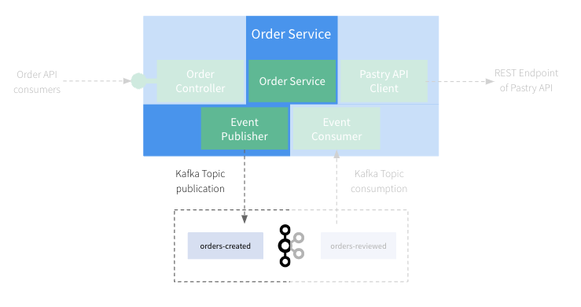
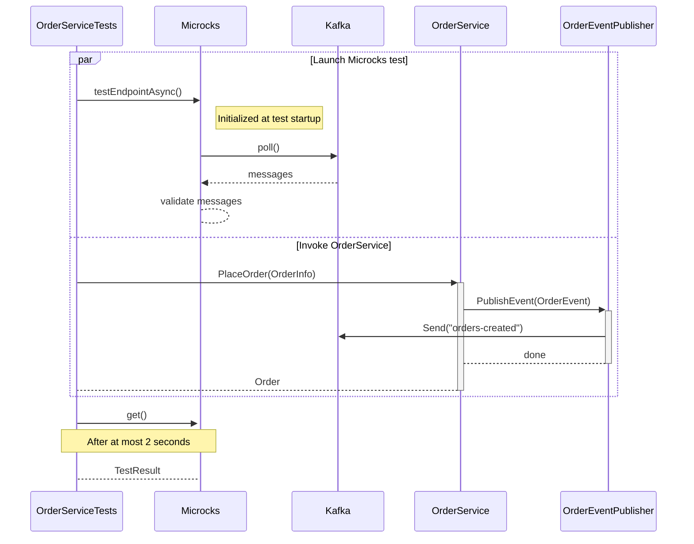
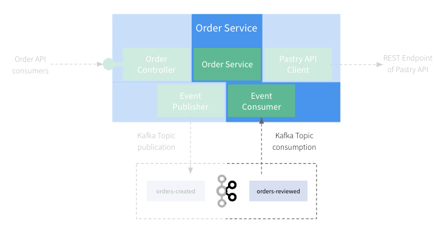
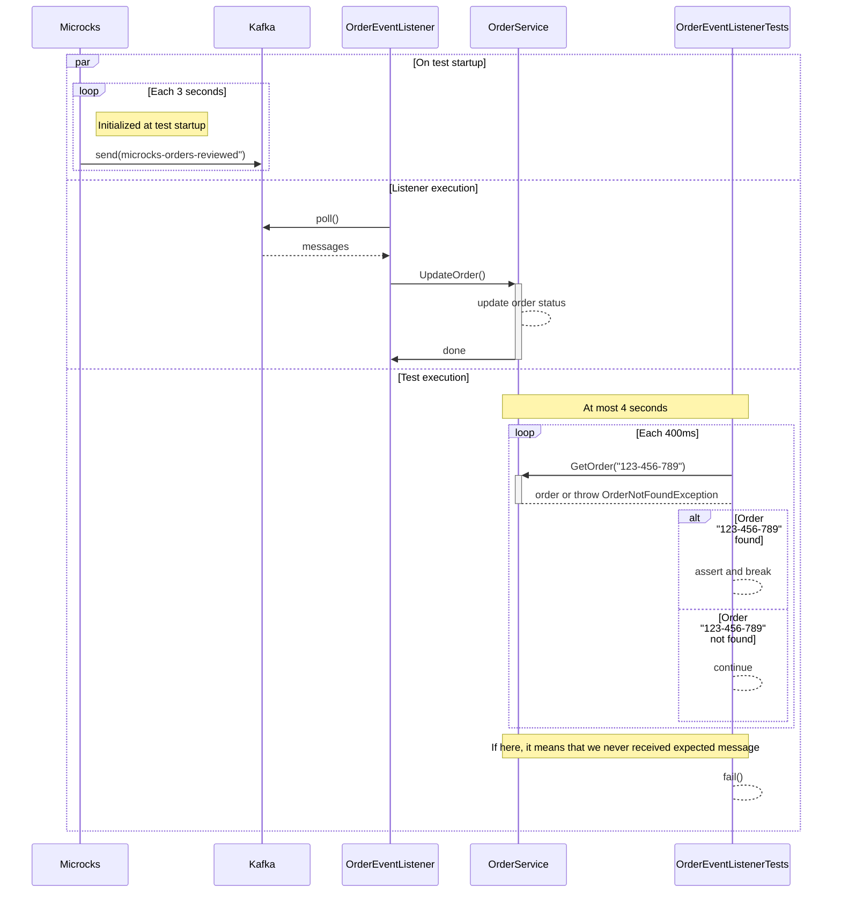

# Step 5: Let's write tests for the Async Events

Now that we address the REST/Synchronous part, let's have a look on the part related to Asynchronous Kafka events.
Testing of asynchronous or event-driven system is usually a pain for developers 🥲

## First Test - Verify our OrderService is publishing events

In this section, we'll focus on testing the `Order Service` + `Event Publisher` components of our application:



Even if it may be easy to check that the creation of an event object has been triggered with frameworks like [Gomock](https://github.com/uber-go/mock)
or others, it's far more complicated to check that this event is correctly serialized, sent to a broker and valid
regarding an Event definition...

Fortunately, Microcks and TestContainers make this thing easy!

Let's review the test function `TestOrderEventIsPublishedWhenOrderIsCreated` under `internal/test/suite_test.go`.

```go
func (s *BaseSuite) TestOrderEventIsPublishedWhenOrderIsCreated() {
	ctx := context.Background()
	// Prepare a Microcks Tests.
	testRequest := client.TestRequest{
		ServiceId:          "Order Events API:0.1.0",
		RunnerType:         client.TestRunnerTypeASYNCAPISCHEMA,
		TestEndpoint:       "kafka://kafka:19092/orders-created",
		Timeout:            2000,
		FilteredOperations: &[]string{"SUBSCRIBE orders-created"},
	}

	// Prepare an application Order.
	info := model.OrderInfo{
		CustomerID: "123-456-789",
		ProductQuantities: []model.ProductQuantity{
			{
				ProductName: "Millefeuille",
				Quantity:    1,
			},
			{
				ProductName: "Eclair Cafe",
				Quantity:    1,
			},
		},
		TotalPrice: 8.4,
	}

	testResultChan := make(chan *client.TestResult)
	go func() {
		err := s.microcksEnsemble.GetMicrocksContainer().TestEndpointAsync(ctx, &testRequest, testResultChan)
		s.NoError(err)
	}()

	time.Sleep(500 * time.Millisecond)

	// Invoke the application to create an order.
	createdOrder, err := s.app.AppService.OrderService.PlaceOrder(&info)
	s.Require().NoError(err)

	// You may check additional stuff on createdOrder...
	s.NotNil(createdOrder)
	s.NotEmpty(createdOrder.ID)

	// Get the Microcks test result.
	testResult := <-testResultChan
	s.Require().NoError(err)

	s.T().Logf("Test Result success is %t", testResult.Success)

	// Log TestResult raw structure.
	j, err := json.Marshal(testResult)
	s.Require().NoError(err)
	s.T().Log(string(j))

	s.Require().True(testResult.Success)
    s.Equal(1, len(*testResult.TestCaseResults)) //nolint:testifylint
}
```

> You can execute this test from your IDE or from the terminal using the `go test ./internal/test -test.timeout=20m -failfast -v -test.run TestBaseSuite -testify.m ^TestOrderEventIsPublishedWhenOrderIsCreated` command

Things are a bit more complex here, but we'll walk through step-by-step:
* Similarly to previous section, we prepared a Microcks-provided `TestRequest` object
  * We ask for a `AsyncAPI Schema` conformance test that will use the definition found into the `order-events-asyncapi.yml` contract,
  * We ask Microcks to listen to the `kafka://kafka:19092/orders-created` endpoint that represents the `orders-created` topic on our Kafka broker managed by Testcontainers,
  * We ask to focus on a specific operation definition to mimic consumers that subscribe to the  `orders-created` channel,
  * We specified a timeout value that means that Microcks will only listen during 5 seconds for incoming messages. 
* We also prepared an `OrderInfo` object that will be used as the input of the `PlaceOrder()` function invocation on application's `OrderService`.
* Then, we launched the test on the Microcks side. This time, the launch is asynchronous, so we're using a go routine that will give us a `TestResult` later on
on a `testResultChan` channel
  * We wait a bit here to ensure, Microcks got some time to start the test and connect to Kafka broker.
* We can invoke our business service by creating an order with `PlaceOrder()` method. We could assert whatever we want on created order as well.
* Finally, we wait for the routine completion to retrieve the `TestResult` on channel and assert on the success and check we received 1 message as a result.

The sequence diagram below details the test sequence. You'll see 2 parallel blocks being executed:
* One that corresponds to Microcks test - where it connects and listen for Kafka messages,
* One that corresponds to the `OrderService` invokation that is expected to trigger a message on Kafka.



Because the test is a success, it means that Microcks has received an `OrderEvent` on the specified topic and has validated the message conformance with 
the AsyncAPI contract or this event-driven architecture. So you're sure that all your NestJS configuration, Kafka JSON serializer configuration and network 
communication are actually correct!

### 🎁 Bonus step - Verify the event content

So you're now sure that an event has been sent to Kafka and that it's valid regarding the AsyncAPI contract. But what about the content of this event? 
If you want to go further and check the content of the event, you can do it by asking Microcks the events read during the test execution and actually 
check their content. This can be done adding a few lines of code:

```go
func (s *BaseSuite) TestOrderEventIsPublishedWhenOrderIsCreated() {
	// [...] Unchanged comparing previous step.

	// Get the Microcks test result.
	testResult := <-testResultChan

	// [...] Unchanged comparing previous step.

	// Check the content of the emitted event, read from Kafka topic.
	events, err := s.microcksEnsemble.GetMicrocksContainer().EventMessagesForTestCase(ctx, testResult, "SUBSCRIBE orders-created")
	s.Require().NoError(err)
	s.Equal(1, len(*events)) //nolint:testifylint

	message := (*events)[0].EventMessage
	var messageMap map[string]interface{}
	err = json.Unmarshal([]byte(*message.Content), &messageMap)
	s.Require().NoError(err)

	s.Equal("Creation", messageMap["changeReason"].(string))

	orderMap := messageMap["order"].(map[string]interface{})
	s.Equal("123-456-789", orderMap["customerId"].(string))
	s.Equal(8.4, orderMap["totalPrice"].(float64))

	productQuantities := orderMap["productQuantities"].([]interface{})
	s.Equal(2, len(productQuantities)) //nolint:testifylint
}
```

> You can execute this test from your IDE or from the terminal using the `go test ./internal/test -test.timeout=20m -failfast -v -test.run TestBaseSuite -testify.m ^TestOrderEventIsPublishedWhenOrderIsCreated` command

Here, we're using the `EventMessagesForTestCase()` function on the Microcks container to retrieve the messages read during the test execution. 
Using the wrapped EventMessage class, we can then check the content of the message and assert that it matches the order we've created.

## Second Test - Verify our OrderEventListener is processing events

In this section, we'll focus on testing the `Event Consumer` + `Order Service` components of our application:



The final thing we want to test here is that our `OrderEventListener` component is actually correctly configured for connecting to Kafka, for 
consuming messages, for de-serializing them into correct Java objects and for triggering the processing on the OrderService. That's a lot to do 
and can be quite complex! But things remain very simple with Microcks 😉

Let's review the test function `TestEventIsConsumedAndProcessedByService` under `internal/test/suite_test.go`.

```go
func (s *BaseSuite) TestEventIsConsumedAndProcessedByService() {
	err := waitFor(10*time.Second, func() error {
		order := s.app.AppService.OrderService.GetOrder("123-456-789")
		if order == nil {
			return errors.New("got no order '123-456-789' yet")
		}

		fmt.Printf("Order is %v\n", order)
		s.Equal("lbroudoux", order.CustomerID)
		s.Equal(model.VALIDATED, order.Status)
		s.Len(order.ProductQuantities, 2)
		return nil
	})
	s.Require().NoError(err)
}
```

To fully understand this test, remember that as soon as you're launching the test, we start Kafka and Microcks containers and that Microcks
is immediately starting publishing mock messages on this broker. So this test actually starts with a waiting loop, just checking that the
messages produced by Microcks are correctly received and processed on the application side.

The important things to get in this test are:
* We're waiting at most 4 seconds here because the default publication frequency of Microcks mocks is 3 seconds (this can be configured as you want of course),
* Within each polling iteration, we're checking for the order with id `123-456-789` because these are the values defined within the `order-events-asyncapi.yaml` AsyncAPI contract examples
* If we retrieve this order and get the correct information from the service, it means that is has been received and correctly processed!
* If no message is found before the end of 4 seconds, the loop exits with a `ConditionTimeoutException` and we mark our test as failed.

The sequence diagram below details the test sequence. You'll see 3 parallel blocks being executed:
* The first corresponds to Microcks mocks - where it connects to Kafka, creates a topic and publishes sample messages each 3 seconds,
* The second one corresponds to the `OrderEventListener` invocation that should be triggered when a message is found in the topic,
* The third one corresponds to the actual test - where we check that the specified order has been found and processed by the `OrderService`. 



You did it and succeed in writing integration tests for all your application component with minimum boilerplate code! 🤩

## Wrap-up

Thanks a lot for being through this quite long demonstration. We hope you learned new techniques for integration tests with both REST and Async/Event-driven APIs. Cheers! 🍻